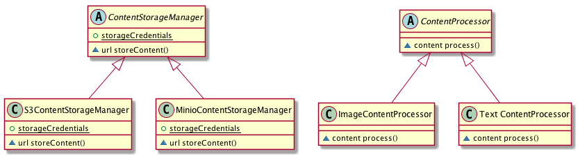

# Distributed Web Scraper 

This project involves development of a web scraper service which for given URL downloads HTML inner text and images embedded on given website. It is oriented on long-running jobs and easy embedding on service-oriented architectures. 

## Platform independent model
Before writing any code it is worth to analyze the problem and conceptualize required effort. The diagram below presents the platfrom-independent model, which doesn't have to be concerned with implementation. It presents in *rough terms* what needs to be accomplished from the requirements standpoint. 

Arrows represent _what_ uses _what_. _What_ is defined by objects which are composed of actions and properties. Implementation may and will deviate from this model but for anyone trying to get a bird's eye view

In this example, _APIFrontend_ is exposing REST actions for scraping jobs. The user is talking to the rest API. The _ScrapeJob_ manages outcomes of download,processing and storage. If _ContentDownloader_ wants to use a proxy, it can request working proxy from the _DownloadProxyManager_ 

This conceptualization gets more concrete, especially when there is an explicit requirement for different content types (images, text) and storage engine is not certain. If images are big enough, an object storage might be suitable solution. For smaller chunks of data, we migt use different storage 

## Platform-specific architecture